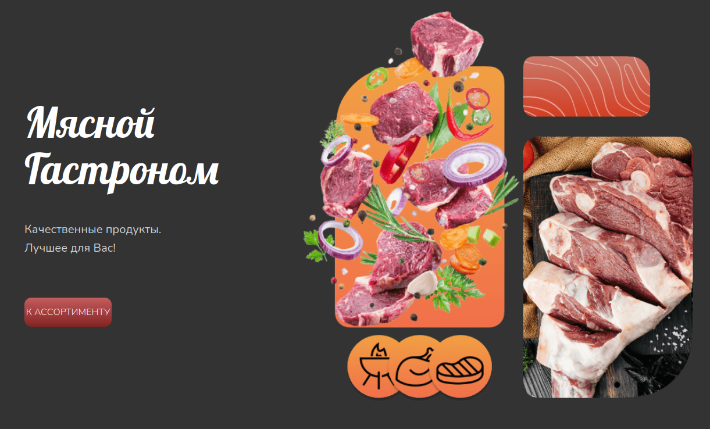
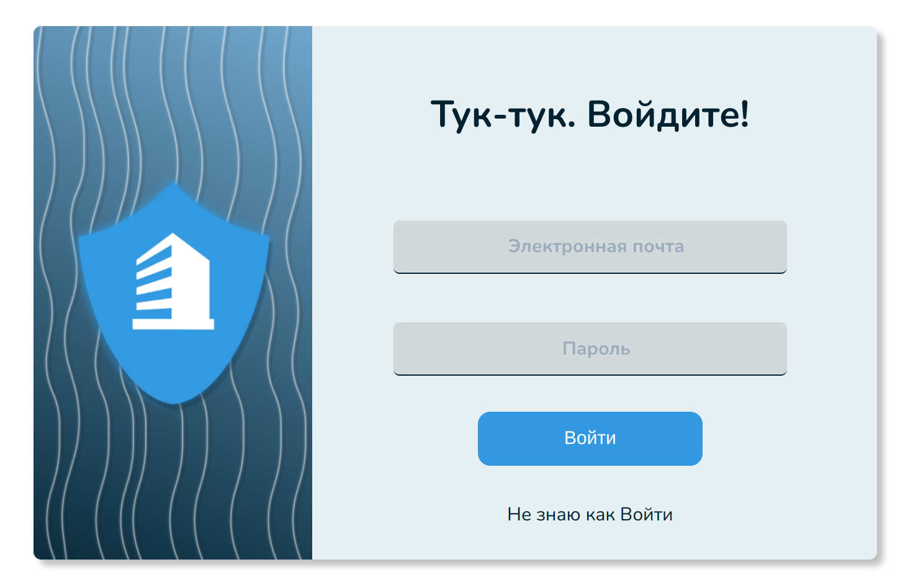

# Лендинги и прочая вёрстка

В этом репозитории собрана коллекция моих лендингов, дизайнов и просто вёрстки :sunglasses:

Галлерея [здесь :floppy_disk:](https://neketli.github.io/landings/)

## Landing page :star:

### Мясной гастроном :cut_of_meat:

[myasnoy-bataysk.ru](myasnoy-bataysk.ru)

Один из первых лендингов, который я сверстал на чистом html,css,js + jquery. Так же использовалась утилита textolite качестве админки. Хостинг - [timeweb](https://timeweb.com/ru/services/hosting/)

Так же это мой дебют по дизайну в figma - [посмотреть можно здесь](https://www.figma.com/file/hRNI1o1vn6hfEtl1N7Qdzq/Myasnoy?node-id=0%3A1)

### Букинг агенство "Батарея" :guitar:

[Ссылка](https://neketli.github.io/landings/rock-landing)

html, scss, js + simple adaptive slider

[Так же мой дизайн](https://www.figma.com/file/QMZZ2pgkUuPhQaXEvOAI3j/Rock-landing?node-id=21%3A6)

### Портфолио видеомонтажёра :movie_camera:

[Ссылка](https://neketli.github.io/landings/video-portfolio)

Очень хотелось реализовать идею поэкранной прокрутки.
html, scss, js + swiper

[Дизайн](https://www.figma.com/file/OzNw8ewKtChAarK6OUMheY/lihimovich_portfolio?node-id=0%3A1)

## Прочее :closed_book:

### Страница входа

[Ссылка](https://neketli.github.io/landings/ddg-login-form)

Реализовано в рамках хакатона, по кейсу ddos-guard.net - authetify.
[Дизайн](https://www.figma.com/file/pJd96Dxhr3euT0xjAvBHSL/dstu-hackathon-spring-2022)
